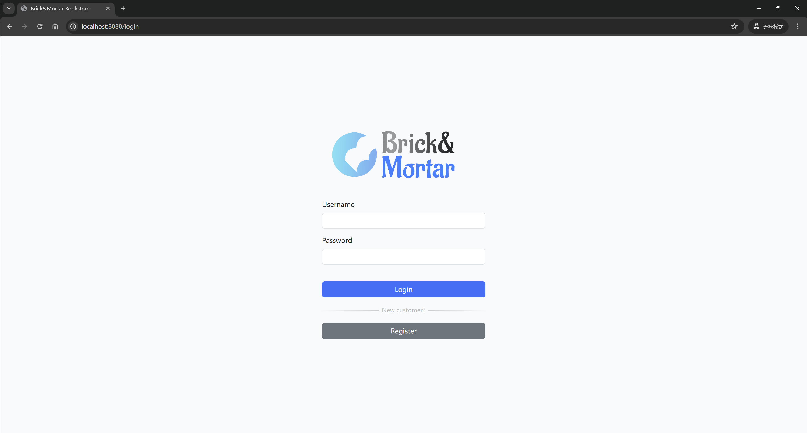
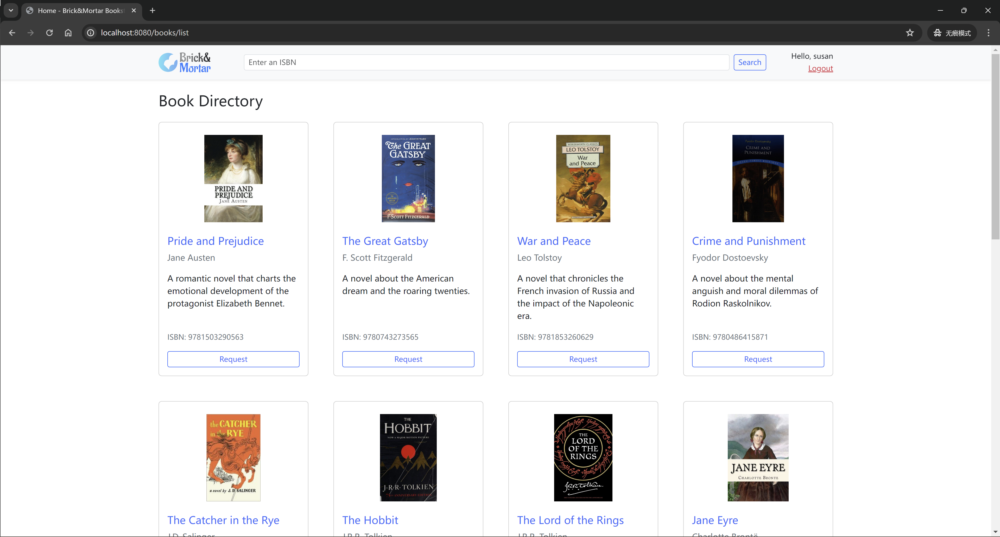
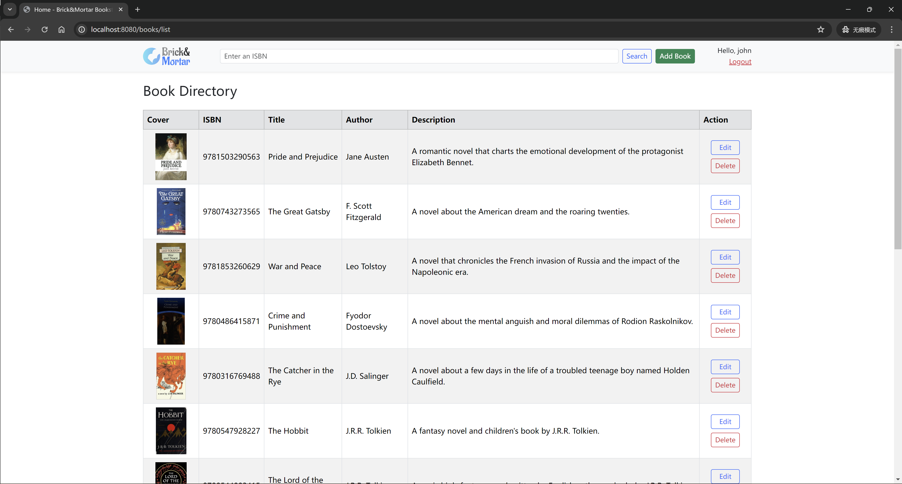
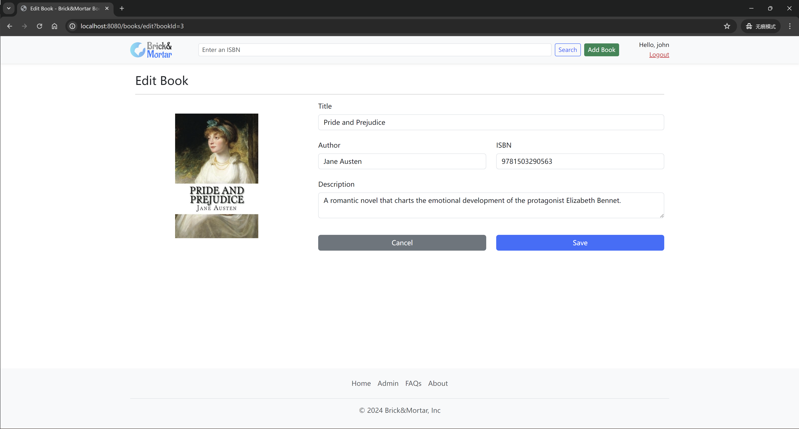

## Brick&Mortar - Online Bookstore Management System

Brick&Mortar is an online bookstore management system designed to streamline book browsing, searching, and purchasing. Powered by Java, Spring Boot, and MySQL, the system includes robust admin controls for inventory management and secure handling of customer purchase requests through role-based access.

## Screenshots

### Login

### Home (User)

#### Home (Admin)

### Manage books (Admin)

